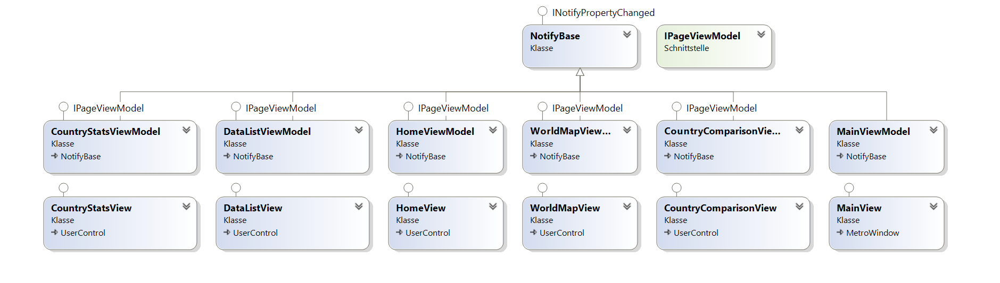
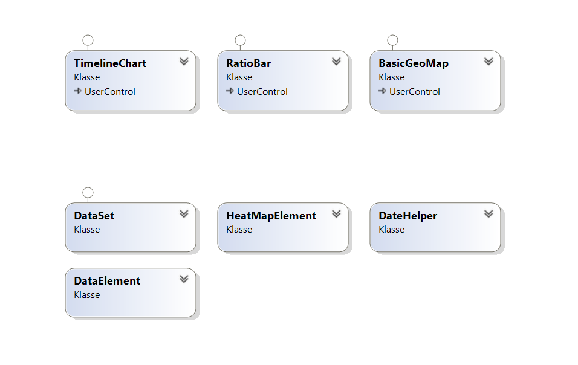
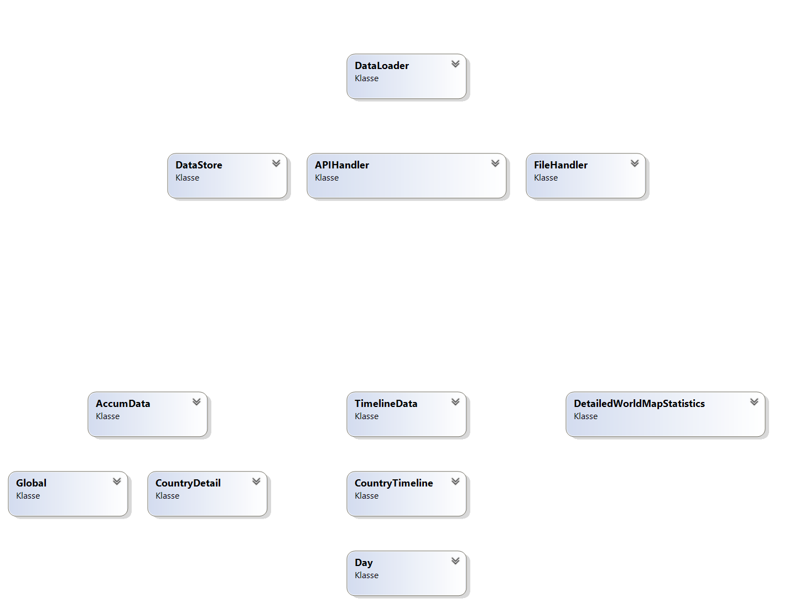

# Klassenbeschreibung

## Views

## Charts

Damit die Diagramme nicht selbst gezeichnet werden müssen, wurde eine externe Bibliothek dazu verwendet.
Die Wahl fiel dabei auf die Bibliothek LiveCharts, da diese die für uns relevanten Diagrammtypen zur Verfügung stellt.

Folgende Diagramme werden dargestellt:

1. Ein Balkendiagramm zur Darstellung eines Datensatzes über die Zeit.
2. Ein horizontales Balkendiagramm zur Darstellung von Verhältnissen.
3. Eine Weltkarte als Heatmap.

Jeder Diagrammtyp wurde in einem eigenem `UserControl` verwirklicht, um die Schnittstelle zu den Bibliothekstypen
anzupassen und eventuelle Unzulänglichkeiten ausmerzen zu können.

Die `UserControl`s `TimelineChart`, `RatioBar` und `BasicGeoMap` implementieren diese Möglichkeiten.
Neben der Datenschnittstelle stellen `TimelineChart` und `RatioBar` auch die Möglichkeit bereit, die Diagramme zu
animieren und, im Falle von `TimelineChart`, auch zwischen einigen wenigen Darstellungsarten zu wählen und die
Achsenskalierung der Y-Achse zwischen linear und logarithmisch zu ändern.

All diese Funktionen wurden per Dependency-Properties implementiert, damit diese in den Views auch per Data-Binding
angesteuert werden können.

## Model

